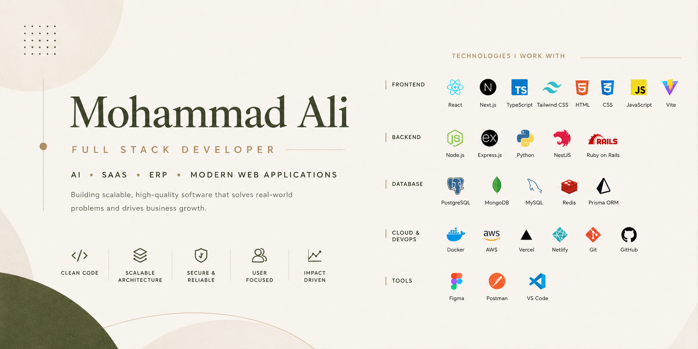

<p align="center">
  
</p>

<!-- <h1 align="center">
Hi 👋, I'm Mohammad Ali
</h1>

<h3 align="center">
Full Stack Developer • AI • SaaS • ERP • Modern Web Applications
</h3>

<p align="center">
Building scalable, production-ready software with clean architecture,
modern technologies, and exceptional user experiences.
</p> -->

<p align="center">

<a href="https://www.alidev.in">

</a>

<a href="https://www.linkedin.com/in/mohammadalidhanga">

</a>

<a href="mailto:malidhanga.work@gmail.com">

</a>

<a href="https://github.com/mohammadali-eth">

</a>

<a href="https://www.hackerrank.com/profile/mohammadalidhan1">

</a>

</p>

<p align="center">

</p>

---

# 💫 About Me

```javascript
const mohammadAli = {
  role: "Full Stack Developer",
  specialization: [
    "Enterprise Software",
    "AI Applications",
    "ERP Systems",
    "SaaS Platforms",
  ],

  currentlyLearning: ["System Design", "Cloud Architecture", "DevOps"],

  openTo: ["Freelance", "Remote Jobs", "Full-time Opportunities"],
};
```

- 💻 Passionate about building scalable web applications.
- 🚀 Focused on AI, ERP, SaaS and Business Automation.
- ⚡ Love solving real-world business problems.
- 🌱 Always learning modern technologies.
- 🤝 Open for exciting collaborations.

---

# 🚀 Current Focus

- AI Powered SaaS Products
- Enterprise ERP Solutions
- Backend Architecture
- Cloud Deployment
- DevOps Automation
- Performance Optimization

---

# 💻 Tech Stack

### Frontend

<p>

</p>

### Backend

<p>

</p>

### Database

<p>

</p>

### Cloud & DevOps

<p>

</p>

### Tools

<p>

</p>

---

# 🌟 Featured Projects

| Project             | Description                                                                              | Tech                               |
| ------------------- | ---------------------------------------------------------------------------------------- | ---------------------------------- |
| 🚀 **Invix**        | AI-powered invoicing platform with billing, analytics, payment tracking and automation.  | React • Ruby on Rails • PostgreSQL |
| 🌍 **Tazora**       | Personal Life Operating System for goals, habits, productivity and knowledge management. | Next.js • TypeScript               |
| 🏢 **VendorBridge** | Procurement & Vendor Management ERP with RFQ workflow and approvals.                     | React • Node.js • Prisma           |
| 🏥 **Aegis-MD**     | Medical Inventory & Pharmacy Management System.                                          | React • Express • PostgreSQL       |

---

# 📈 GitHub Statistics

<p align="center">


</p>

<p align="center">


</p>

<p align="center">


</p>

---

# 🏆 GitHub Trophies

<p align="center">


</p>

---

# ⚡ What I Build

- Enterprise ERP Applications
- AI Powered SaaS Platforms
- Business Automation Software
- REST APIs
- Authentication Systems
- Inventory Management
- Admin Dashboards
- Procurement Systems
- CRM Platforms
- Modern UI/UX

---

# 🌐 Connect With Me

<p align="center">

<a href="https://www.alidev.in">

</a>

<a href="https://www.linkedin.com/in/mohammadalidhanga">

</a>

<a href="mailto:malidhanga.work@gmail.com">

</a>

<a href="https://github.com/mohammadali-eth">

</a>

</p>

---

<h2 align="center">
💡 Building software that solves real-world problems.
</h2>

<h3 align="center">
⭐ Thanks for visiting my profile!
</h3>
